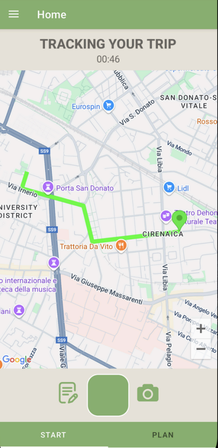

# TravelCompanion

TravelCompanion is an Android application project developed in Kotlin for the Laboratory in Mobile Applications at University of Bologna, AY 2024-2025. The main goal of this app is to assist users in planning, tracking, and enhancing their travel experiences. 

## Features

- **Interactive Maps:** Integration with Google Maps and location services to track the user's path on the map.
- **Data Visualization:** Uses MPAndroidChart for visualizing travel statistics and predictions on their future values.
- **Trip Management:** Plan, track, and manage trips.
- **Work Scheduling:** Background tasks handled with WorkManager (such as the reminder to track your trips after the user has not used the app for a while).
- **Room Database:** Uses Room for robust local data storage.
- **Modern UI:** Built with Material Components and with a responsive and user-friendly interface.
- **Navigation:** Utilizes Navigation Component for seamless screen transitions.

The image below shows an example view of the app after starting a trip.\
The marker indicates the starting point and the user's path is displayed on the map.\


## Tech Stack

- **Language:** Kotlin
- **Minimum SDK:** 24
- **Target SDK:** 35
- **Libraries & Tools:**
  - AndroidX (Core, AppCompat, Lifecycle, Navigation, WorkManager, Fragment)
  - Google Maps SDK & Utilities
  - MPAndroidChart
  - Room (Database)
  - Material Components
  - SearchableSpinner

## Getting Started

### Prerequisites
- Android Studio (recommended latest stable)
- Android SDK 24 or higher

### Build Instructions

1. **Clone the repository:**
   ```bash
   git clone https://github.com/enisb1/TravelCompanion.git
   ```

2. **Open in Android Studio:**  
   Open the project folder in Android Studio.

3. **Build the project:**  
   The required dependencies are managed via Gradle. Sync and build the project through Android Studio.

4. **Run the app:**  
   Connect an Android device or start an emulator, then run the app.

## Project Structure

- `app/` - Main Android application source code and resources.
- `build.gradle.kts` - Project and module-level build configuration.
